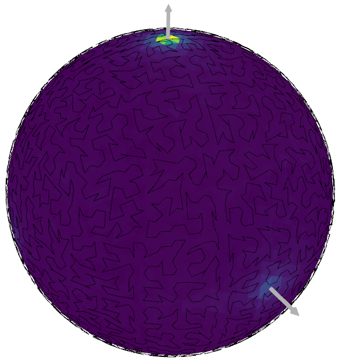

.. FastGA documentation master file, created by
   sphinx-quickstart on Mon Apr  3 14:18:28 2017.
   You can adapt this file completely to your liking, but it should at least
   contain the root `toctree` directive.

-----------

FastGA: A Fast Gaussian Accumulator
=======================================================

.. only: not latex

    Contents:

.. _getting_started_index:

.. toctree::
    :maxdepth: 1
    :caption: Getting Started

    introduction
    builddocs

.. _tutorial_index:

.. toctree::
    :maxdepth: 1
    :caption: Tutorial

    tutorial/Python/index
    tutorial/C++/index

.. _python_api_index:

.. toctree::
    :maxdepth: 1
    :caption: Python API

    python_api/fastga
    python_api/fastga.peak_and_cluster

..
    Please put the module and meta data you want here!
    MAKE_DOCS/python_api/fastga
    MAKE_DOCS/python_api/fastga.peak_and_cluster   python_only

.. _cpp_api_index:

.. toctree::
    :maxdepth: 1
    :caption: C++ API

    cpp_api/cpp_library_root

..
